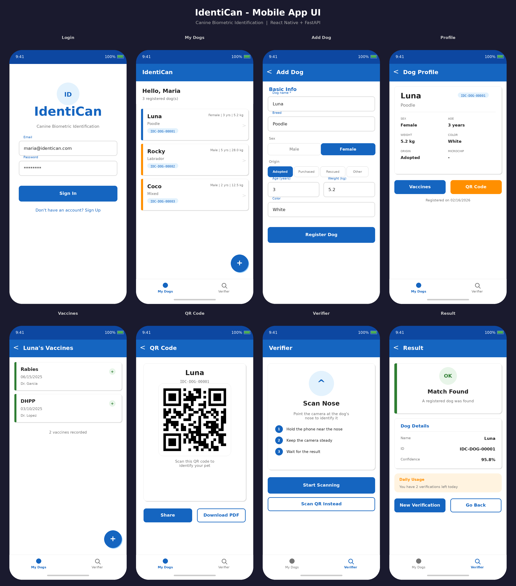

# IdentiCan

Plataforma de identificación biométrica canina, mediante fotografía de narices. Registrá a tu perro, guardá sus vacunas y generá un QR único para identificarlo.

## App Preview



## Características

- **Registro de perros** con datos completos (raza, peso, origen, etc.)
- **Identificación biométrica** por huella nasal (basado en Pet-ReID-IMAG)
- **Código QR único** por perro (PNG + PDF 3x3cm para collar)
- **Registro de vacunas** con historial completo
- **Roles**: usuario, verificador, admin

## Estructura del Proyecto

```
IdentiCan/
├── backend/       # API REST (FastAPI + PostgreSQL)
├── mobile/        # App móvil (React Native + Expo)
├── ml_model/      # Modelo ML (Pet-ReID-IMAG)
├── docs/          # Documentación
└── .github/       # CI/CD workflows
```

## Quick Start

### Backend

```bash
cd backend
python -m venv venv && source venv/bin/activate
pip install -r requirements.txt
cp .env.example .env  # Editar con tus valores
uvicorn app.main:app --reload
```

Documentación API: `http://localhost:8000/docs`

### Mobile

```bash
cd mobile
npm install
npx expo start
```

Escanear el QR con Expo Go.

## Stack Tecnológico

| Componente | Tecnología |
|-----------|------------|
| Backend | FastAPI, SQLAlchemy, PostgreSQL |
| Auth | JWT (python-jose), bcrypt |
| Mobile | React Native, Expo SDK 50 |
| UI | React Native Paper |
| ML | Pet-ReID-IMAG (ResNeSt) |
| Deploy | Railway (backend), EAS (mobile) |

## Documentación

- [Instalación](docs/SETUP.md)
- [API Reference](docs/API.md)
- [Deployment](docs/DEPLOYMENT.md)
- [Arquitectura](docs/ARCHITECTURE.md)

## Modelo ML

El directorio `ml_model/` contiene el modelo Pet-ReID-IMAG, solución del 3er puesto en CVPR2022 Biometrics Workshop Pet Biometric Challenge. Logra 91.7% de precisión en identificación de mascotas.

## Licencia

Código de la aplicación: MIT License. Ver [LICENSE.md](LICENSE.md).

El modelo ML mantiene su licencia original.
